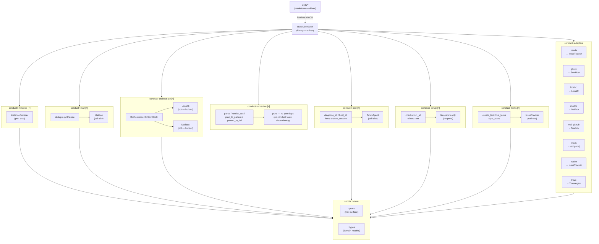

# Dependency Diagram

<!-- generated by `conductr architect diagram --tier dependency` -->
<!-- source: .claude/base.md + Cargo.toml walk -->
<!-- repo: conductr (Luan-vP/conductr) -->

> **Note** — `conductr-schedule` is not described explicitly in `.claude/base.md` as a named arm, but is present in the workspace and follows hex rules (pure crate; no `conductr-core` dependency).

## Legend

| Symbol | Meaning |
|--------|---------|
| `[+]` suffix on subgraph label | Collapsible subgraph (mermaid v7700+); label suffix on older renderers |
| `→ PortName` | Implements the named port trait |
| `(call-site)` | Port injected as a function parameter, not a constructor field |
| `(opt — builder)` | Optional dependency added via a `.with_foo()` builder method |
| `pure — no port deps` | Crate has no dependency on `conductr-core` or `conductr-adapters` |

## Services

| Crate | Layer | Entry Points | Injected Ports |
|-------|-------|-------------|----------------|
| `conductr` | driver | CLI binary | all arms + adapters |
| `conductr-instance` | arm | `InstanceProvider` (port stub) | `conductr-core` |
| `conductr-mail` | arm | `dedup`, `synthesise` | `Mailbox` (call-site) |
| `conductr-orchestrate` | arm | `Orchestrator<C: ScmHost>` | `ScmHost` (generic), `Mailbox` (opt), `LocalCi` (opt) |
| `conductr-pod` | arm | `diagnose_all`, `heal_all`, `ensure_session`, `free` | `TmuxAgent` (call-site) |
| `conductr-schedule` | arm (pure) | `parse`, `render_ascii`, `plan_to_pattern`, `pattern_to_dsl` | — |
| `conductr-setup` | arm | `checks::run_all`, `wizard::run` | — (filesystem only) |
| `conductr-tasks` | arm | `create_task`, `list_tasks`, `sync_tasks` | `IssueTracker` (call-site) |
| `conductr-core` | core | `::types`, `::ports` | — |
| `conductr-adapters` | adapters | feature-flagged impls | all ports |
