# Ports Diagram

<!-- generated by `conductr architect diagram --tier ports` -->
<!-- source: .claude/base.md + Cargo.toml walk + crates/conductr-core/src/ports.rs -->
<!-- repo: conductr (Luan-vP/conductr) -->

> **Finding** `conductr-calendar`: service crate exists in workspace but is not described in `.claude/base.md` — update base.md to add this arm.

> **Finding** port `CalendarPort`: defined in `conductr-core/src/ports.rs` but not listed in `.claude/base.md` ports table — base.md is out of date.

> **Finding** port `LocalAgent`: defined in `conductr-core/src/ports.rs` but not listed in `.claude/base.md` ports table; has no arm-crate DI consumer — used directly by the driver layer (`crates/conductr`).

> **Finding** port `LocalCi`: defined in `conductr-core/src/ports.rs` but not listed in `.claude/base.md` ports table — base.md is out of date.

> **Finding** adapter `GcalAdapter` (`gcal` feature → `CalendarPort`): impl exists in `conductr-adapters` but not described in `.claude/base.md`.

> **Finding** adapter `LlamaCpp` (`llamacpp` feature → `LocalAgent`): impl exists in `conductr-adapters` but not described in `.claude/base.md`.

> **Finding** adapter `LocalCiAdapter` (`local-ci` feature → `LocalCi`): impl exists in `conductr-adapters` but not described in `.claude/base.md`.

> **Finding** adapter `OllamaAdapter` (`ollama` feature → `LocalAgent`): impl exists in `conductr-adapters` but not described in `.claude/base.md`.

```mermaid
graph TD
    %% conductr · architecture diagram · tier=ports
    %% Mermaid v7700 expandable-node syntax.
    %% Degradation: on pre-v7700 renderers this renders as standard nested subgraphs.
    %% The "[+]" label suffix signals a collapsible group to v7700-capable renderers.

    %% ── driver layer ───────────────────────────────────────────────────────────
    CLI["crates/conductr\n(binary — driver)"]
    SKILLS["skills/*\n(markdown — driver)"]
    SKILLS -->|invokes via CLI| CLI

    %% ── service arms ───────────────────────────────────────────────────────────

    subgraph cal["conductr-calendar [+]"]
        direction LR
        CAL_SVC["reconcile / schedule_test_slot"]
        subgraph cal_CalendarPort["CalendarPort [+]"]
            direction LR
            CAL_CP_GCAL["GcalAdapter\n(gcal feature)"]
            CAL_CP_MOCK["MockCalendarPort\n(mock feature)"]
        end
        subgraph cal_ScmHost["ScmHost [+]"]
            direction LR
            CAL_SCM_GH["GhCli\n(gh-cli feature)"]
            CAL_SCM_MOCK["MockScmHost\n(mock feature)"]
        end
        CAL_SVC --> cal_CalendarPort
        CAL_SVC --> cal_ScmHost
    end

    subgraph inst["conductr-instance [+]"]
        direction LR
        INST_SVC["InstanceProvider\n(port stub — re-exported)"]
        subgraph inst_InstanceProvider["InstanceProvider [+]"]
            direction LR
            INST_IP_MOCK["MockInstanceProvider\n(mock feature)"]
        end
        INST_SVC --> inst_InstanceProvider
    end

    subgraph mail["conductr-mail [+]"]
        direction LR
        MAIL_SVC["dedup / synthesise"]
        subgraph mail_Mailbox["Mailbox [+]"]
            direction LR
            MAIL_MB_FS["FsMailbox\n(mail-fs feature)"]
            MAIL_MB_GH["GhMailbox\n(mail-github feature)"]
            MAIL_MB_MOCK["MockMailbox\n(mock feature)"]
        end
        MAIL_SVC --> mail_Mailbox
    end

    subgraph orch["conductr-orchestrate [+]"]
        direction LR
        ORCH_SVC["Orchestrator&lt;C: ScmHost&gt;"]
        ORCH_LOCALCI["LocalCi\n(opt — builder)"]
        ORCH_MAILBOX["Mailbox\n(opt — builder)"]
        subgraph orch_LocalCi["LocalCi [+]"]
            direction LR
            ORCH_CI_ADAPTER["LocalCiAdapter\n(local-ci feature)"]
        end
        subgraph orch_Mailbox["Mailbox [+]"]
            direction LR
            ORCH_MB_FS["FsMailbox\n(mail-fs feature)"]
            ORCH_MB_GH["GhMailbox\n(mail-github feature)"]
            ORCH_MB_MOCK["MockMailbox\n(mock feature)"]
        end
        subgraph orch_ScmHost["ScmHost [+]"]
            direction LR
            ORCH_SCM_GH["GhCli\n(gh-cli feature)"]
            ORCH_SCM_MOCK["MockScmHost\n(mock feature)"]
        end
        ORCH_LOCALCI --> orch_LocalCi
        ORCH_MAILBOX --> orch_Mailbox
        ORCH_SVC --> ORCH_LOCALCI
        ORCH_SVC --> ORCH_MAILBOX
        ORCH_SVC --> orch_ScmHost
    end

    subgraph pod["conductr-pod [+]"]
        direction LR
        POD_SVC["diagnose_all / heal_all\nfree / ensure_session"]
        subgraph pod_TmuxAgent["TmuxAgent [+]"]
            direction LR
            POD_TX_MOCK["MockTmuxAgent\n(mock feature)"]
            POD_TX_TMUX["Tmux\n(tmux feature)"]
        end
        POD_SVC --> pod_TmuxAgent
    end

    subgraph sched["conductr-schedule [+]"]
        direction LR
        SCHED_SVC["parse / render_ascii\nplan_to_pattern / pattern_to_dsl"]
        SCHED_NOTE["pure — no port deps\n(no conductr-core dependency)"]
        SCHED_SVC --> SCHED_NOTE
    end

    subgraph setup["conductr-setup [+]"]
        direction LR
        SETUP_SVC["checks::run_all\nwizard::run"]
        SETUP_NOTE["filesystem only\n(no ports)"]
        SETUP_SVC --> SETUP_NOTE
    end

    subgraph tasks["conductr-tasks [+]"]
        direction LR
        TASKS_SVC["create_task / list_tasks\nsync_tasks"]
        subgraph tasks_IssueTracker["IssueTracker [+]"]
            direction LR
            TASKS_IT_BEADS["Beads\n(beads feature)"]
            TASKS_IT_MOCK["MockIssueTracker\n(mock feature)"]
            TASKS_IT_NOTION["Notion\n(notion feature)"]
        end
        TASKS_SVC --> tasks_IssueTracker
    end

    %% ── core ───────────────────────────────────────────────────────────────────

    subgraph core["conductr-core"]
        CORE_PORTS["::ports\n(trait surface)"]
        CORE_TYPES["::types\n(domain models)"]
    end

    %% ── driver → arms ──────────────────────────────────────────────────────────
    CLI --> cal
    CLI --> inst
    CLI --> mail
    CLI --> orch
    CLI --> pod
    CLI --> sched
    CLI --> setup
    CLI --> tasks

    %% ── arms → core ────────────────────────────────────────────────────────────
    cal   --> core
    inst  --> core
    mail  --> core
    orch  --> core
    pod   --> core
    setup --> core
    tasks --> core
```

## Legend

| Symbol | Meaning |
|--------|---------|
| `[+]` suffix on subgraph label | Collapsible subgraph (mermaid v7700+); label suffix on older renderers |
| `⚠ no impls` | Port trait has no adapter implementations — architectural gap |
| `(<feature> feature)` | Adapter is compiled only when the named feature flag is enabled |
| `(call-site)` | Port injected as a function parameter, not a constructor field |
| `(opt — builder)` | Optional dependency added via a `.with_foo()` builder method |
| `pure — no port deps` | Crate has no dependency on the core port traits |

## Port → Adapter Map

Derived from `crates/conductr-core/src/ports.rs` + `crates/conductr-adapters/src/`.

| Port | Adapter Struct | Feature Flag | Arm Consumers |
|------|---------------|--------------|---------------|
| `CalendarPort` | `GcalAdapter` | `gcal` | `conductr-calendar` |
| `CalendarPort` | `MockCalendarPort` | `mock` | `conductr-calendar` |
| `InstanceProvider` | `MockInstanceProvider` | `mock` | `conductr-instance` |
| `IssueTracker` | `Beads` | `beads` | `conductr-tasks` |
| `IssueTracker` | `MockIssueTracker` | `mock` | `conductr-tasks` |
| `IssueTracker` | `Notion` | `notion` | `conductr-tasks` |
| `LocalAgent` | `LlamaCpp` | `llamacpp` | _(driver only)_ |
| `LocalAgent` | `MockLocalAgent` | `mock` | _(driver only)_ |
| `LocalAgent` | `OllamaAdapter` | `ollama` | _(driver only)_ |
| `LocalAgent` | `PiStub` | `mock` | _(driver only)_ |
| `LocalCi` | `LocalCiAdapter` | `local-ci` | `conductr-orchestrate` |
| `Mailbox` | `FsMailbox` | `mail-fs` | `conductr-mail`, `conductr-orchestrate` |
| `Mailbox` | `GhMailbox` | `mail-github` | `conductr-mail`, `conductr-orchestrate` |
| `Mailbox` | `MockMailbox` | `mock` | `conductr-mail`, `conductr-orchestrate` |
| `ScmHost` | `GhCli` | `gh-cli` | `conductr-calendar`, `conductr-orchestrate` |
| `ScmHost` | `MockScmHost` | `mock` | `conductr-calendar`, `conductr-orchestrate` |
| `TmuxAgent` | `MockTmuxAgent` | `mock` | `conductr-pod` |
| `TmuxAgent` | `Tmux` | `tmux` | `conductr-pod` |

> **Note** — `LocalAgent` is not injected into any arm crate; it is instantiated directly by the driver (`crates/conductr`) for the `run-task` and `idle` subcommands.
