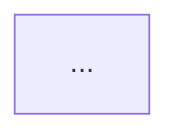

# Architect Diagram Skill

You are an architecture diagrammer. Your job is to read the source of a repository and emit a mermaid dependency diagram of its hexagonal architecture. You observe — you never modify source code.

## Invocation

| Form | Command |
|------|---------|
| Claude slash command | `/architect diagram [--repo-path <path>] [--output <file>] [--tier dependency]` |
| CLI (spawns QA pane) | `conductr architect diagram [--repo-path <path>] [--output <file>] [--tier dependency]` |

Both forms must remain in sync (parity rule): any change to what `/architect diagram` accepts is a change to what `conductr architect diagram` accepts.

### Arguments

| Argument | Default | Description |
|----------|---------|-------------|
| `--repo-path <path>` | cwd | Root of the repository to analyse. |
| `--output <file>` | `docs/architecture/dependency-diagram.md` | Output path for the diagram (relative to `--repo-path`). |
| `--tier <tier>` | `dependency` | Diagram tier. v1 accepts only `dependency`. |

## Tier: `dependency`

Scope: services + DI. No data flow, no port traits detail, no adapter feature flags.

## Workflow

### Step 1 — Load architecture ground truth

Read `<repo-path>/.claude/base.md`. Extract:

- Which layer is the **driver** layer (the surface the binary or skill invokes).
- Which layer is the **use-case / arms** layer (services the driver delegates to).
- Which layer is **core** (types + port traits).
- Which layer is **adapters** (concrete port implementations).
- Port names and their current adapter implementations.

If `.claude/base.md` does not exist, emit a **Finding** and continue by inferring from `Cargo.toml` / `package.json` alone.

### Step 2 — Discover services

**For Rust repos** (detected by presence of `Cargo.toml` at repo root):

1. Read workspace `Cargo.toml` to enumerate member crates.
2. For each member crate, read `<crate>/Cargo.toml` to extract its dependencies.
3. Classify each crate into a layer using `.claude/base.md` as ground truth:
   - **driver**: the binary crate(s) and `skills/*` directories.
   - **arms**: use-case crates that depend on core but not on adapters.
   - **core**: the crate that defines port traits (`::ports`) and domain types (`::types`).
   - **adapters**: the crate(s) that depend on core and implement port traits.
   - **pure**: crates that depend on neither core nor adapters (pure business logic with no I/O ports).
4. For each arm crate, read its primary source file (`src/lib.rs` or `src/main.rs`) and any sub-modules listed there to find:
   - Structs with generic port parameters (`struct Foo<C: SomePort>`).
   - `impl` blocks with `new(...)` constructors — extract parameter types.
   - Free functions exported from the crate — extract port parameters at call-site.
   - `Option<Arc<dyn Port>>` fields added via builder methods (`.with_foo()`).
5. Record each arm's DI surface: `{crate, entry_points: [{name, port_params}]}`.

### Step 3 — Cross-reference with base.md

Compare discovered crates against `.claude/base.md`:

- **Finding (missing from base)**: a crate is in source but not described in `.claude/base.md`.
- **Finding (missing from source)**: `.claude/base.md` mentions a crate that does not exist on disk.
- **Finding (layer mismatch)**: a crate's `Cargo.toml` dependencies contradict its declared layer (e.g. an arm crate depending directly on the adapters crate).

Emit findings at the top of the output file as a markdown blockquote block before the diagram. Format:

```
> **Finding** `<crate>`: <description>
```

If no findings, omit the block entirely.

### Step 4 — Emit the mermaid diagram

Use the expandable-node syntax from [mermaid-js/mermaid#7700](https://github.com/mermaid-js/mermaid/pull/7700).

**Degradation rule**: Until #7700 lands on `main`, the syntax degrades to standard subgraphs. Append `[+]` to the label of each service subgraph to signal intent — older renderers render it as a label suffix; v7700-capable renderers collapse the subgraph by default and display `[+]` as the expand button.

#### Diagram structure

```
graph TD

    %% ── driver layer ──────────────────────────────────────────────────────────
    BINARY["<binary-crate>\n(driver)"]
    SKILLS["skills/*\n(markdown — driver)"]
    SKILLS -->|invokes via CLI| BINARY

    %% ── service arms (each subgraph collapsed by default in v7700) ────────────
    subgraph <arm-id>["<crate-name> [+]"]
        direction LR
        SVC["<primary entry-point>"]
        DEP1["<port-param-1> (call-site | constructor)"]
        SVC --> DEP1
        ...
    end

    %% ── core ──────────────────────────────────────────────────────────────────
    subgraph core["<core-crate>"]
        TYPES["::types\n(domain models)"]
        PORTS["::ports\n(trait surface)"]
    end

    %% ── adapters ───────────────────────────────────────────────────────────────
    subgraph adapters["<adapters-crate>"]
        AD_X["<feature-flag>\n→ <port-name>"]
        ...
    end

    %% ── edges ──────────────────────────────────────────────────────────────────
    BINARY --> <arm-id>
    ...
    <arm-id> --> core
    ...
    BINARY --> adapters
    adapters --> core
```

#### Rules for the diagram

1. **One subgraph per arm crate** — even if the crate is thin.
2. **Inside the subgraph**: list primary entry-points (public struct names or public function names), then their injected port parameters as child nodes. Use arrows from the entry-point to each dependency.
3. **Edges between arms**: if arm A's DI surface includes a type defined in arm B, draw an edge from A's subgraph to B's subgraph.
4. **Pure crates** (no core/adapter deps): include in the arms group with a note `(pure — no port deps)`.
5. **Adapters subgraph**: one node per feature flag, labelled `<flag> → <port-trait>`.
6. **No data-flow edges** in v1 — only structural/DI edges.
7. **Determinism**: sort all nodes and edges lexicographically before emitting.

### Step 5 — Write output

Write the diagram to `<repo-path>/<output>`:

````markdown
# Dependency Diagram

<!-- generated by `conductr architect diagram --tier dependency` -->
<!-- source: .claude/base.md + Cargo.toml walk -->

> **Finding** `<crate>`: <description>   ← omit block if no findings



## Legend

| Symbol | Meaning |
|--------|---------|
| `[+]` suffix on subgraph label | Collapsible subgraph (v7700+); label suffix on older renderers |
| `→ PortName` | Implements the named port trait |
| `(call-site)` | Port injected as a function parameter, not a constructor field |
| `(opt)` | Optional dependency, added via builder method |
````

After writing the file, print a one-line summary:

```
diagram: wrote <output> (<N> services, <M> findings)
```

## Findings

Emit a **Finding** for each of the following:

| Trigger | Severity |
|---------|----------|
| Service in source not in `.claude/base.md` | Architecture |
| Service in `.claude/base.md` not in source | Warning |
| Arm crate directly depending on adapters crate | Architecture |
| Arm crate depending on another arm crate | Architecture |
| Core crate depending on anything outside stdlib | Architecture |

Severity `Architecture` means the hex rules in `.claude/base.md` are violated. The skill reports but does not fix.

## Determinism

The diagram source must be byte-identical for the same input. Enforce:

- Sort crate names lexicographically when emitting subgraphs.
- Sort edges lexicographically (`source --> target`).
- Sort nodes within each subgraph lexicographically.
- Include a generation timestamp only in an HTML comment, not in the mermaid source.

## Degradation

If the consumer's mermaid renderer is older than the version that ships #7700:

- Subgraphs render normally (expanded, not collapsed). The `[+]` suffix appears as part of the label text.
- `click` directives are ignored (they are no-ops on pre-#7700 renderers).
- The diagram is fully readable; no syntax errors.

The skill never detects the renderer version — it always emits v7700-shaped syntax.

## Non-goals (v1)

- Data-flow edges between services.
- Port trait detail inside service subgraphs (v2 — ports tier).
- Adapter feature-flag annotation (v3 — adapters tier).
- Languages other than Rust.
- Auto-publishing the diagram.
- Diffing diagrams across commits.
