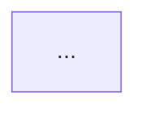

# Architect Diagram Skill

You are an architecture diagrammer. Your job is to read the source of a repository and emit mermaid diagrams of its hexagonal architecture. You observe — you never modify source code.

## Invocation

| Form | Command |
|------|---------|
| Claude slash command | `/architect diagram [--repo-path <path>] [--output <file>] [--tier dependency\|ports]` |
| CLI (spawns QA pane) | `conductr architect diagram [--repo-path <path>] [--output <file>] [--tier dependency\|ports]` |

Both forms must remain in sync (parity rule): any change to what `/architect diagram` accepts is a change to what `conductr architect diagram` accepts.

### Arguments

| Argument | Default | Description |
|----------|---------|-------------|
| `--repo-path <path>` | cwd | Root of the repository to analyse. |
| `--output <file>` | tier-dependent (see below) | Output path for the diagram (relative to `--repo-path`). |
| `--tier <tier>` | `dependency` | Diagram tier: `dependency` (v1) or `ports` (v2). |

**Default output paths** (overridable with `--output`):

| `--tier` | Default output |
|----------|---------------|
| `dependency` | `docs/architecture/dependency-diagram.md` |
| `ports` | `docs/architecture/ports-diagram.md` |

## Tier: `dependency`

Scope: services + DI. No data flow, no port traits detail, no adapter feature flags.

## Tier: `ports`

Scope: services + DI + port trait expansion + adapter leaf nodes. Extends the dependency view by revealing, for each port-typed DI item in a service's constructor surface, which concrete adapters implement that port.

The diagram hierarchy is:

```
Service subgraph [+]
  └─ DI node (port-typed) [+]
       └─ Adapter leaf node  (one per impl)
  └─ DI node (concrete-typed — stays flat, v1 behaviour)
```

- **Trait-typed DI**: any parameter whose type is a port trait (abstract dependency) gets an expandable sub-subgraph showing the port name and all adapter struct names that `impl PortTrait for AdapterName`.
- **Concrete-typed DI**: direct dependency on another service or helper — stays flat (v1 behaviour unchanged).
- **Port with zero adapters**: render a visible `⚠ no impls` leaf node — this is an architectural finding worth surfacing in the diagram.
- Adapter internals and feature-flag annotations are **not** shown (v3 scope).

## Workflow (both tiers share Steps 1–3; tiers diverge at Step 4)

### Step 1 — Load architecture ground truth

Read `<repo-path>/.claude/base.md`. Extract:

- Which layer is the **driver** layer (the surface the binary or skill invokes).
- Which layer is the **use-case / arms** layer (services the driver delegates to).
- Which layer is **core** (types + port traits).
- Which layer is **adapters** (concrete port implementations).
- Port names and their current adapter implementations.

If `.claude/base.md` does not exist, emit a **Finding** and continue by inferring from `Cargo.toml` / `package.json` alone.

### Step 2 — Discover services

**For Rust repos** (detected by presence of `Cargo.toml` at repo root):

1. Read workspace `Cargo.toml` to enumerate member crates.
2. For each member crate, read `<crate>/Cargo.toml` to extract its dependencies.
3. Classify each crate into a layer using `.claude/base.md` as ground truth:
   - **driver**: the binary crate(s) and `skills/*` directories.
   - **arms**: use-case crates that depend on core but not on adapters.
   - **core**: the crate that defines port traits (`::ports`) and domain types (`::types`).
   - **adapters**: the crate(s) that depend on core and implement port traits.
   - **pure**: crates that depend on neither core nor adapters (pure business logic with no I/O ports).
4. For each arm crate, read its primary source file (`src/lib.rs` or `src/main.rs`) and any sub-modules listed there to find:
   - Structs with generic port parameters (`struct Foo<C: SomePort>`).
   - `impl` blocks with `new(...)` constructors — extract parameter types.
   - Free functions exported from the crate — extract port parameters at call-site.
   - `Option<Arc<dyn Port>>` fields added via builder methods (`.with_foo()`).
5. Record each arm's DI surface: `{crate, entry_points: [{name, port_params}]}`.

### Step 3 — Cross-reference with base.md

Compare discovered crates against `.claude/base.md`:

- **Finding (missing from base)**: a crate is in source but not described in `.claude/base.md`.
- **Finding (missing from source)**: `.claude/base.md` mentions a crate that does not exist on disk.
- **Finding (layer mismatch)**: a crate's `Cargo.toml` dependencies contradict its declared layer (e.g. an arm crate depending directly on the adapters crate).

Emit findings at the top of the output file as a markdown blockquote block before the diagram. Format:

```
> **Finding** `<crate>`: <description>
```

If no findings, omit the block entirely.

### Step 4 — Emit the mermaid diagram

Use the expandable-node syntax from [mermaid-js/mermaid#7700](https://github.com/mermaid-js/mermaid/pull/7700).

**Degradation rule**: Until #7700 lands on `main`, the syntax degrades to standard subgraphs. Append `[+]` to the label of each service subgraph to signal intent — older renderers render it as a label suffix; v7700-capable renderers collapse the subgraph by default and display `[+]` as the expand button.

#### Diagram structure

```
graph TD

    %% ── driver layer ──────────────────────────────────────────────────────────
    BINARY["<binary-crate>\n(driver)"]
    SKILLS["skills/*\n(markdown — driver)"]
    SKILLS -->|invokes via CLI| BINARY

    %% ── service arms (each subgraph collapsed by default in v7700) ────────────
    subgraph <arm-id>["<crate-name> [+]"]
        direction LR
        SVC["<primary entry-point>"]
        DEP1["<port-param-1> (call-site | constructor)"]
        SVC --> DEP1
        ...
    end

    %% ── core ──────────────────────────────────────────────────────────────────
    subgraph core["<core-crate>"]
        TYPES["::types\n(domain models)"]
        PORTS["::ports\n(trait surface)"]
    end

    %% ── adapters ───────────────────────────────────────────────────────────────
    subgraph adapters["<adapters-crate>"]
        AD_X["<feature-flag>\n→ <port-name>"]
        ...
    end

    %% ── edges ──────────────────────────────────────────────────────────────────
    BINARY --> <arm-id>
    ...
    <arm-id> --> core
    ...
    BINARY --> adapters
    adapters --> core
```

#### Rules for the diagram

1. **One subgraph per arm crate** — even if the crate is thin.
2. **Inside the subgraph**: list primary entry-points (public struct names or public function names), then their injected port parameters as child nodes. Use arrows from the entry-point to each dependency.
3. **Edges between arms**: if arm A's DI surface includes a type defined in arm B, draw an edge from A's subgraph to B's subgraph.
4. **Pure crates** (no core/adapter deps): include in the arms group with a note `(pure — no port deps)`.
5. **Adapters subgraph**: one node per feature flag, labelled `<flag> → <port-trait>`.
6. **No data-flow edges** in v1 — only structural/DI edges.
7. **Determinism**: sort all nodes and edges lexicographically before emitting.

### Step 5 — Write output

Write the diagram to `<repo-path>/<output>`:

````markdown
# Dependency Diagram

<!-- generated by `conductr architect diagram --tier dependency` -->
<!-- source: .claude/base.md + Cargo.toml walk -->

> **Finding** `<crate>`: <description>   ← omit block if no findings



## Legend

| Symbol | Meaning |
|--------|---------|
| `[+]` suffix on subgraph label | Collapsible subgraph (v7700+); label suffix on older renderers |
| `→ PortName` | Implements the named port trait |
| `(call-site)` | Port injected as a function parameter, not a constructor field |
| `(opt)` | Optional dependency, added via builder method |
````

After writing the file, print a one-line summary:

```
diagram: wrote <output> (<N> services, <M> findings)
```

---

## Ports tier — additional steps (only when `--tier ports`)

After completing Steps 1–3, perform the following before emitting the diagram.

### Step P1 — Discover port traits

**For Rust repos**: read `<core-crate>/src/ports.rs` (the file that defines all port traits). For each `trait <Name>: ...` block:
- Record the trait name.
- Extract method signatures (names only — signatures are v3+ detail).

### Step P2 — Discover adapter implementations

For each adapter source file in `<adapters-crate>/src/`:
1. Find every `impl <PortTrait> for <AdapterStruct>` block.
2. Record the mapping: `{ port: PortTrait, adapter_struct: AdapterStruct, feature: <feature-flag inferred from #[cfg(feature = "...")] or module name> }`.

Cross-reference each discovered port trait against `.claude/base.md`:
- **Finding (port not in base.md)**: a port trait exists in `ports.rs` but is not listed in `.claude/base.md`. This means `base.md` is out of date.
- **Finding (adapter not in base.md)**: an adapter impl exists in source but is not described in the ports table in `.claude/base.md`.
- **Finding (no impls)**: a port trait has zero adapter implementations → render a `⚠ no impls` leaf node under that port.

### Step P3 — Classify DI as port-typed vs concrete-typed

For each DI item already discovered in Step 2 of the main workflow:
- If the parameter/field type matches a trait name found in Step P1 → **port-typed** (gets expansion).
- Otherwise → **concrete-typed** (stays flat, v1 behaviour).

### Step P4 — Emit the ports-tier diagram

Use the same overall structure as the dependency diagram, but add nested port sub-subgraphs inside each service subgraph:

```
graph TD

    %% ── driver layer ──────────────────────────────────────────────────────────
    BINARY["<binary-crate>\n(binary — driver)"]
    SKILLS["skills/*\n(markdown — driver)"]
    SKILLS -->|invokes via CLI| BINARY

    %% ── service arms ──────────────────────────────────────────────────────────
    subgraph <arm-id>["<crate-name> [+]"]
        direction LR
        SVC["<entry-point>"]
        %% concrete-typed DI (flat, same as v1)
        DEP_CONCRETE["<ConcreteType>\n(call-site)"]
        SVC --> DEP_CONCRETE
        %% port-typed DI (expandable sub-subgraph)
        subgraph <arm-id>_<PortName>["<PortName> [+]"]
            direction LR
            AD1["<AdapterStruct1>\n(<feature1> feature)"]
            AD2["<AdapterStruct2>\n(<feature2> feature)"]
        end
        SVC --> <arm-id>_<PortName>
    end

    %% ── core ──────────────────────────────────────────────────────────────────
    subgraph core["<core-crate>"]
        CORE_PORTS["::ports\n(trait surface)"]
        CORE_TYPES["::types\n(domain models)"]
    end

    %% ── driver → arms, arms → core (same as dependency tier) ──────────────────
    ...
```

**Port sub-subgraph ID convention**: `<arm-id>_<PortName>` — prefix with the parent arm ID to avoid ID collisions when the same port appears under multiple arms.

**Rules for the ports diagram** (in addition to the dependency-tier rules):
1. Port sub-subgraphs are sorted lexicographically within each service subgraph.
2. Adapter leaf nodes within a port sub-subgraph are sorted lexicographically.
3. The adapters top-level subgraph from v1 is **omitted** from the ports diagram (redundant with the per-service port expansions).
4. Pure crates and no-port services retain their v1 rendering (flat, no port expansion).
5. If a port has zero adapters, render a single `⚠ no impls` leaf node instead.

### Step P5 — Write output

Write the diagram to `<repo-path>/<output>` (default: `docs/architecture/ports-diagram.md`):

````markdown
# Ports Diagram

<!-- generated by `conductr architect diagram --tier ports` -->
<!-- source: .claude/base.md + Cargo.toml walk + ports.rs -->

> **Finding** `<item>`: <description>   ← omit block if no findings


## Legend

| Symbol | Meaning |
|--------|---------|
| `[+]` suffix on subgraph label | Collapsible subgraph (mermaid v7700+); label suffix on older renderers |
| `⚠ no impls` | Port trait has no adapter implementations — architectural gap |
| `(<feature> feature)` | Adapter is compiled only when the named feature flag is enabled |
| `(call-site)` | Port injected as a function parameter, not a constructor field |
| `(opt — builder)` | Optional dependency added via a `.with_foo()` builder method |
| `pure — no port deps` | Crate has no dependency on the core port traits |
````

---

## Findings

Emit a **Finding** for each of the following:

| Trigger | Tier | Severity |
|---------|------|----------|
| Service in source not in `.claude/base.md` | both | Architecture |
| Service in `.claude/base.md` not in source | both | Warning |
| Arm crate directly depending on adapters crate | both | Architecture |
| Arm crate depending on another arm crate | both | Architecture |
| Core crate depending on anything outside stdlib | both | Architecture |
| Port trait in `ports.rs` not described in `.claude/base.md` | ports | Architecture |
| Adapter `impl` in source not listed in `.claude/base.md` | ports | Warning |
| Port trait with zero adapter implementations | ports | Architecture |

Severity `Architecture` means the hex rules in `.claude/base.md` are violated. The skill reports but does not fix.

## Determinism

The diagram source must be byte-identical for the same input. Enforce:

- Sort crate names lexicographically when emitting subgraphs.
- Sort edges lexicographically (`source --> target`).
- Sort nodes within each subgraph lexicographically.
- Include a generation timestamp only in an HTML comment, not in the mermaid source.

## Degradation

If the consumer's mermaid renderer is older than the version that ships #7700:

- Subgraphs render normally (expanded, not collapsed). The `[+]` suffix appears as part of the label text.
- `click` directives are ignored (they are no-ops on pre-#7700 renderers).
- The diagram is fully readable; no syntax errors.

The skill never detects the renderer version — it always emits v7700-shaped syntax.

## Non-goals (v1 — `dependency` tier)

- Data-flow edges between services.
- Port trait detail inside service subgraphs (v2 — ports tier).
- Adapter feature-flag annotation (v3 — adapters tier).
- Languages other than Rust.
- Auto-publishing the diagram.
- Diffing diagrams across commits.

## Non-goals (v2 — `ports` tier)

- Port method signatures inside expansions (v3+ option).
- Adapter internals or feature-flag annotations (v3 — adapters tier).
- Multi-language port discovery beyond what v1 already supports.
- Data-flow edges.
